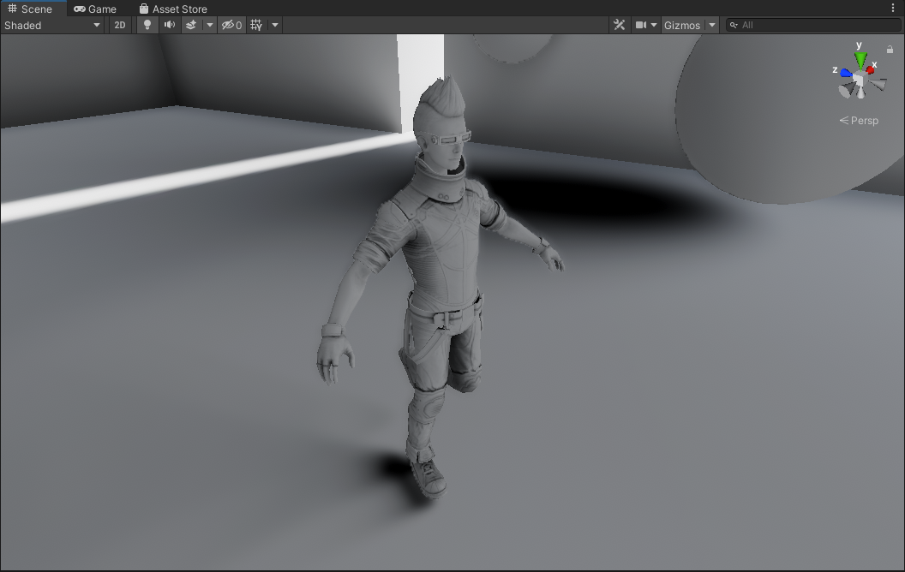
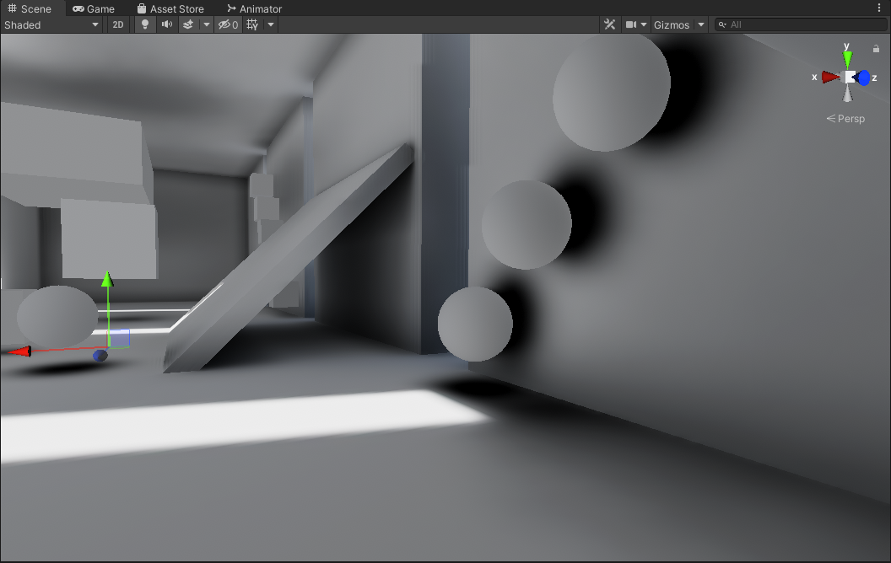

# Unity Capsule Shadows

A work in progress solution for capsule shadows in Unity.

# Results

# Features

Capsule shadows for dynamic objects.

- Compute Shader based.
- Adjustable softness via cone angle.
- Sample light directionality from multiple sources (Lightmap Directionality, Spherical Harmonics, or a Global Direction).
- Bilinear filter for upsampling when the effect is performed at a lower resolution.

**NOTE: Constructed on the Built-In Rendering Pipeline.**

# More Context

### Sources/Credits

- [https://www.shadertoy.com/view/3stcD4](https://www.shadertoy.com/view/3stcD4)
- [Lighting Technology of The Last of Us Part II](https://history.siggraph.org/learning/lighting-technology-of-the-last-of-us-part-ii-by-doghramachi/)
- [Lighting technology of the last of us](http://miciwan.com/SIGGRAPH2013/Lighting%20Technology%20of%20The%20Last%20Of%20Us.pdf)
